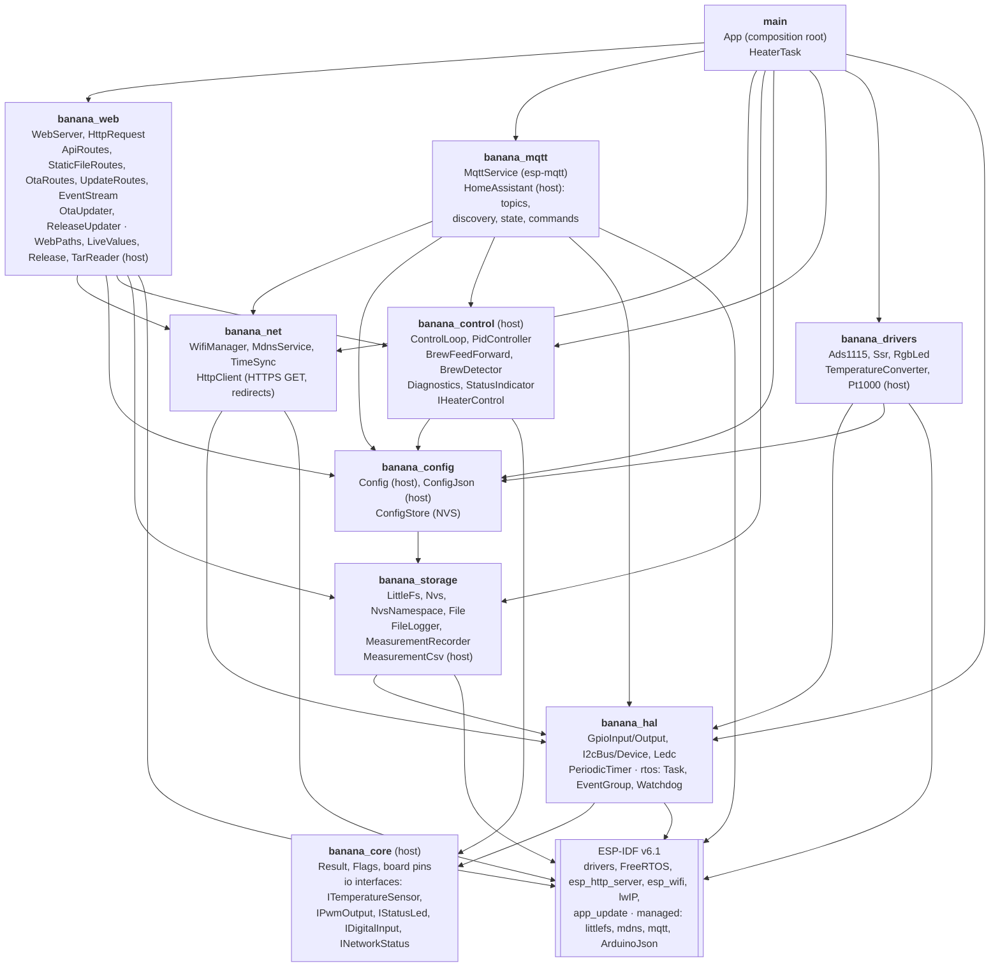
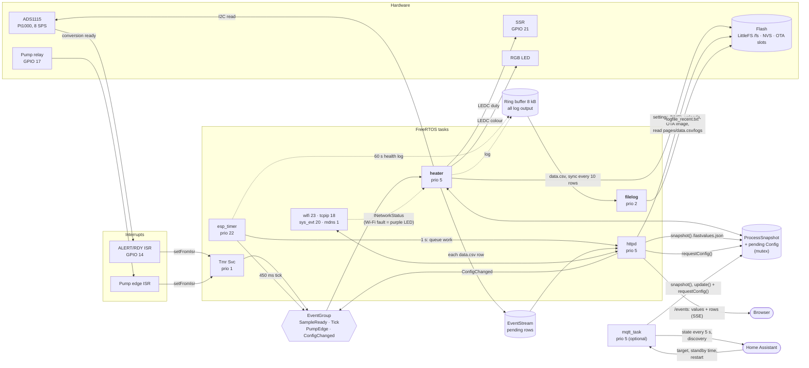

# Architecture

## Components

One ESP-IDF component per layer. Arrows point to what a component uses. Components marked *host* are
pure logic and run in the host unit tests (`test/host`).

The control logic only sees the `io` interfaces (`ITemperatureSensor`, `IPwmOutput`, …), so the same
`ControlLoop` runs on the ESP32 with the real drivers and on the host with fakes. The web routes see the
heater only through `control::IHeaterControl` (`snapshot()`, `requestConfig()`).

## Runtime: tasks, interrupts, data flow

13 FreeRTOS tasks run in steady state (14 with MQTT enabled) (measured with `uxTaskGetSystemState()`; `main` ends after
`App::run()`). Two of them are ours (**bold**); the rest belong to ESP-IDF.

### Task list

| Task        | Prio | Core        | Stack free* | Owner / purpose                                                        |
|-------------|------|-------------|-------------|------------------------------------------------------------------------|
| **heater**  | 5    | 1 (pinned)  | 1756 B / 4096 | `HeaterTask`: ADC read, PID, SSR, LED, brew detection, diagnostics, `data.csv`; subscribed to the task watchdog (75 s) |
| **filelog** | 2    | 1 (pinned)  | 1800 B / 4096 | `FileLogger`: ring buffer → `logfile_recent.txt`, rotation            |
| mqtt_task   | 5    | any         | –           | esp-mqtt client (only with MQTT enabled): publishes queued messages, handles Home Assistant commands |
| httpd       | 5    | any         | 7268 B / 8192 | `esp_http_server`: all web routes, OTA and file uploads, `/events` broadcast |
| update      | 3    | any         | – / 8192    | `ReleaseUpdater`: GitHub release check and installation; created on the first check, then waits |
| esp_timer   | 22   | 0           | 2816 B      | 450 ms tick (`PeriodicTimer`), 60 s health log, 1 s `/events` trigger  |
| Tmr Svc     | 1    | any         | 1472 B      | FreeRTOS timer daemon: carries `EventGroup::setFromIsr()` to the event group |
| sys_evt     | 20   | 0           | 1492 B      | default event loop: `WifiManager::onEvent()` (connect, reconnect, got IP) |
| wifi        | 23   | 0           | 3232 B      | Wi-Fi driver                                                           |
| tcpip       | 18   | any         | 2200 B      | lwIP stack, SNTP                                                       |
| mdns        | 1    | 0           | 2192 B      | `coffee.local` responder                                               |
| ipc0, ipc1  | 24   | 0, 1        | 412 / 532 B | inter-core calls (e.g. stalling the other core during flash writes)     |
| IDLE0, IDLE1| 0    | 0, 1        | ~980 B      | idle tasks                                                             |

\* minimum free stack since boot (high-water mark), 60 s after boot in SoftAP mode.

`heater` and `filelog` are pinned to core 1 (`kControlCore` in `App.cpp`); the Wi-Fi tasks run on core 0.
Sharing the core makes the two take turns (the heater has the higher priority), so a log write to flash
rarely overlaps an ADS1115 read. Bench, stress build with one log line per tick, 170 s: 16 I2C NACKs with
`filelog` unpinned, 23 on core 0, 0–1 on core 1. A flash write still pauses *both* cores on the ESP32, so the
pinning does not shorten the stalls of the heater task, it only avoids the overlap.

### Concurrency rules

- The heater task is the only task that touches the ADC, SSR and LED; everything else talks to it through the
  event group (`requestConfig()` + `ConfigChanged`) or reads the mutex-protected `ProcessSnapshot`.
- ISRs only set event bits (IRAM), no I2C or logging.
- `ConfigStore` has its own mutex; web UI and MQTT change settings with `update()` (read-modify-write under
  one lock), so they cannot overwrite each other. The settings are one NVS blob (atomic replace).
- MQTT publishes with `esp_mqtt_client_enqueue()`: the timer task never waits on the network.
- `EventStream`: the heater task only appends rows to a mutex-protected buffer (dropped when nobody listens);
  subscribing and sending run in the httpd task, so a slow browser never blocks the heater.
- Every task logs through the `vprintf` hook into the ring buffer; only `filelog` writes the log file, so a
  slow flash write never blocks the logging task (full buffer → dropped lines, counted).
- `ReleaseUpdater`: httpd only queues a job and reads the status (mutex); the download and all flash
  writes of an update from GitHub run in the `update` task.
- Flash writes from a task on the other core (httpd: settings, uploads, OTA; update) can still overlap an ADS1115
  read; the driver retries the read once (see [I2C NACKs during flash writes](#i2c-nacks-during-flash-writes)).

## Differences from the Arduino firmware

The firmware is a port of the Arduino firmware `coffee_ctrl_main` (Arduino-ESP32 core 2.x). Web UI,
`params.json` keys (including the misspelt `HighTresholdValue`), `/lastvalues.json` keys and the `data.csv`
format are unchanged. These differences are deliberate; do not "restore" the old behaviour.

**Safety and control**
- A blocking fault (temperature < 10 °C, ADC not answering or not in continuous mode) or standby switches the
  heater off at once. The Arduino firmware wrote the SSR only in the PID step, which the ADC's ready pulse
  triggers, so a dead ADC left the last duty on the heater. No conversion for 1 s counts as an ADC fault.
- A Wi-Fi fault only turns the LED purple (`control::blocksHeating()`); the Arduino firmware stopped heating
  on any fault.
- A settings change resets the PID integrator only when gains, active terms or output limits change (the
  Arduino firmware reset it on every update). With `CtrlIntFactor` 2000 s the integral needs over an hour to
  remove the remaining offset, so every target change from Home Assistant restarted that approach.
- Kept on purpose: standby counts from boot, not from the last use, and lasts until reboot.
- Fault flags are `Flags<Fault>`: the Arduino check `iErrorId == WIFI_DISCONNECT` could never be true because
  `NO_ERROR` was itself a bit. Fault, brewing and standby changes are logged once, not every 0.9 s.

**Settings**
- Stored as one JSON blob in NVS (`banana`/`params`), atomically replaced; survives `idf.py flash` and
  `storage-flash`. An old `params.json` in LittleFS is imported once and renamed `.imported`.
- Missing keys keep their value, both when loading (defaults) and on `/paramUpdate` (current values). The
  Arduino firmware set missing keys to 0 on update and replaced stored `false`/`0` by the defaults on every boot.
- The Wi-Fi password never leaves the device: `/params.json` is generated with an empty password, and an empty
  password in `/paramUpdate` keeps the stored one. Consequence: once a password is stored, an open network
  cannot be set through the web UI. Empty SSID = factory credentials from Kconfig (not written into the settings).
- Wi-Fi changes take effect after a restart (as before).

**Recording, network, web**
- `data.csv` is synced every 10 rows (4.5 s) instead of closed after every row: each sync of a partly filled
  LittleFS block costs 43–49 ms (up to 320 ms during metadata compaction) in the heater task. Trade-off:
  switching the machine off loses up to 4.5 s of the recording. The timestamp line reads `unknown` without
  NTP (the Arduino firmware wrote an uninitialised buffer).
- The heater starts before Wi-Fi (the Arduino `setup()` blocked up to 18 s in `connectWiFi()` first).
  After a successful join the station reconnects on every disconnect; the RSSI is measured live.
- Time zone `CET-1CEST,M3.5.0,M10.5.0/3` (the fixed +3600/+3600 offsets were wrong in winter).
- Pages get live data by server-sent events (`/events`) instead of polling; `graphs.html` no longer downloads
  the whole `data.csv` every 3 s. Charts use the bundled uPlot (Google Charts may not be self-hosted), so no
  page needs internet.
- OTA uploads send the raw body with `X-MD5` / `X-Filename` headers (no multipart parser in
  `esp_http_server`); the MD5 stays mandatory. New images must confirm themselves
  (`CONFIG_BOOTLOADER_APP_ROLLBACK_ENABLE`), otherwise the bootloader rolls back.
- New: the controller installs GitHub releases itself (firmware plus `webui-<version>.tar` with the files
  of `data/`), verified against the release's `MD5SUMS`.
- Dropped: the PID gain-schedule table (`changePidCoeffs`). The firmware never used it, it read past the end
  of its table and mixed up gain and time-constant units.

## Hardware and bench notes

### Pt1000 conversion

The Kconfig choice `BANANA_PT1000_*` selects the converter (default: 5.0 V lookup table). Host tests against
`PT_1000_tabelle.csv` showed:
- the Arduino "3.3 V" lookup table matches a **5.08 V** bridge supply;
- the linear/quadratic coefficients are fits for a **3.3 V** bridge (worst case 10.8 K / 1.03 K) and are about
  50 K off on the 5 V hardware.

### ADS1115

- An ADS1115 that answers on I2C but resets to its power-on defaults as soon as it converts has no proper
  VDD/GND (it is powered through the I2C pull-ups).
- A module that delivers **~128 conversions/s at "8 SPS"** carries a 12-bit ADS1015, not an ADS1115.
- The configuration register value is `0x880C` (as the Arduino `configADS1115()`); the read-back check ignores
  the OS bit, which reads 0 in continuous mode.

### I2C NACKs during flash writes

An ADS1115 conversion read occasionally ends in a NACK ("I2C bus is still busy but software timeout
detected") when a flash write from a task on the *other* core overlaps it. Without `data.csv` recording or
without the FileLogger writing there are no errors; `CONFIG_I2C_ISR_IRAM_SAFE` and a 500 ms I2C timeout made
no difference. The root cause inside the ESP32/IDF I2C path is not known; finding it would need a logic
analyser on SDA/SCL plus a GPIO toggled around flash writes.

Mitigations, both staying: `Ads1115::readRegister()` retries once (stress build: 109 retries in 150 s, none
failed twice), and `heater` + `filelog` share core 1 (see [Task list](#task-list)). On the machine board:
0 NACKs in 7 minutes of heat-up, so the rate seen on the bench is probably wiring-related. The driver's
`E i2c.master` lines can still appear in the log.

## Open validation

- Side-by-side `data.csv` of the Arduino and this firmware for one heat-up and one shot, including the Pt1000
  comparison and LED colours.
- Soak test ≥ 24 h (`health:` log line every 60 s; bench 5 min: heap constant, 0 log drops).
