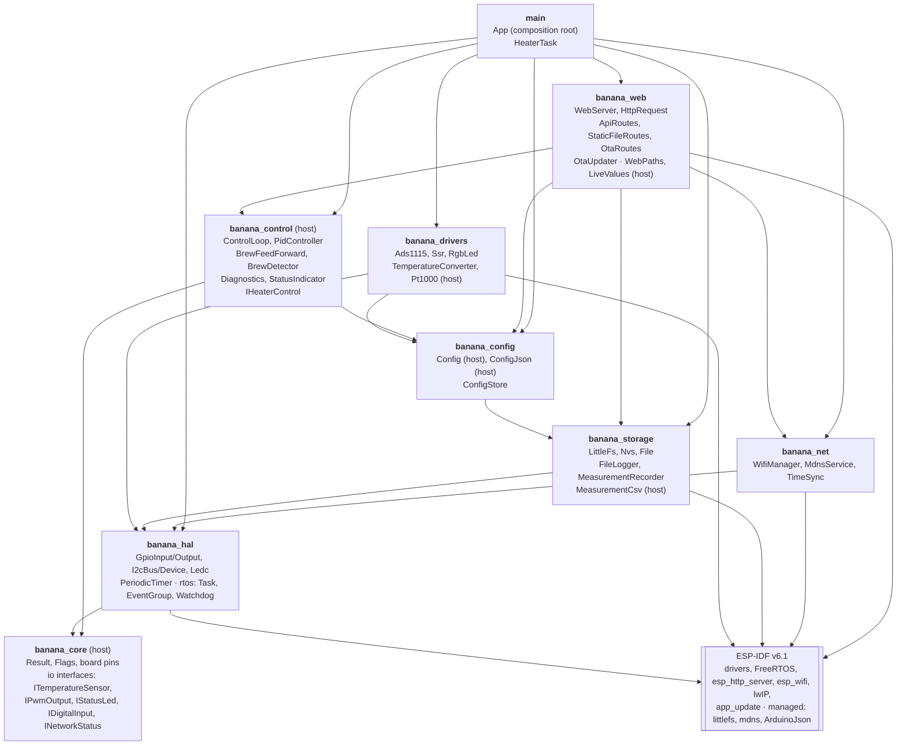
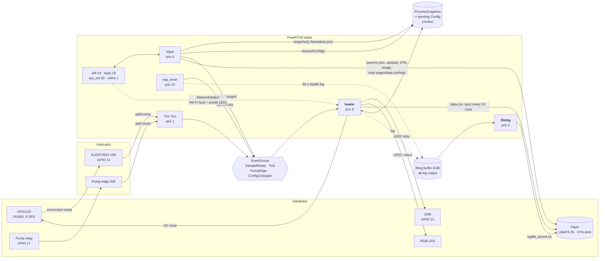

# Architecture

## Components

One ESP-IDF component per layer. Arrows point to what a component uses. Components marked *host* are
pure logic and run in the host unit tests (`test/host`).

The control logic only sees the `io` interfaces (`ITemperatureSensor`, `IPwmOutput`, …), so the same
`ControlLoop` runs on the ESP32 with the real drivers and on the host with fakes. The web routes see the
heater only through `control::IHeaterControl` (`snapshot()`, `requestConfig()`).

## Runtime: tasks, interrupts, data flow

13 FreeRTOS tasks run in steady state (measured with `uxTaskGetSystemState()`; `main` ends after
`App::run()`). Two of them are ours (**bold**); the rest belong to ESP-IDF.

### Task list

| Task        | Prio | Core        | Stack free* | Owner / purpose                                                        |
|-------------|------|-------------|-------------|------------------------------------------------------------------------|
| **heater**  | 5    | 1 (pinned)  | 1756 B / 4096 | `HeaterTask`: ADC read, PID, SSR, LED, brew detection, diagnostics, `data.csv`; subscribed to the task watchdog (75 s) |
| **filelog** | 2    | 1 (pinned)  | 1800 B / 4096 | `FileLogger`: ring buffer → `logfile_recent.txt`, rotation            |
| httpd       | 5    | any         | 7268 B / 8192 | `esp_http_server`: all web routes, OTA and file uploads               |
| esp_timer   | 22   | 0           | 2816 B      | 450 ms tick (`PeriodicTimer`), 60 s health log                         |
| Tmr Svc     | 1    | any         | 1472 B      | FreeRTOS timer daemon: carries `EventGroup::setFromIsr()` to the event group |
| sys_evt     | 20   | 0           | 1492 B      | default event loop: `WifiManager::onEvent()` (connect, reconnect, got IP) |
| wifi        | 23   | 0           | 3232 B      | Wi-Fi driver                                                           |
| tcpip       | 18   | any         | 2200 B      | lwIP stack, SNTP                                                       |
| mdns        | 1    | 0           | 2192 B      | `coffee.local` responder                                               |
| ipc0, ipc1  | 24   | 0, 1        | 412 / 532 B | inter-core calls (e.g. stalling the other core during flash writes)     |
| IDLE0, IDLE1| 0    | 0, 1        | ~980 B      | idle tasks                                                             |

\* minimum free stack since boot (high-water mark), 60 s after boot in SoftAP mode.

`heater` and `filelog` are pinned to core 1 (`kControlCore` in `App.cpp`); the Wi-Fi tasks run on core 0.
Sharing the core makes the two take turns (the heater has the higher priority), so a log write to flash
rarely overlaps an ADS1115 read. Bench, stress build with one log line per tick, 170 s: 16 I2C NACKs with
`filelog` unpinned, 23 on core 0, 0–1 on core 1. A flash write still pauses *both* cores on the ESP32, so the
pinning does not shorten the stalls of the heater task, it only avoids the overlap.

### Concurrency rules

- The heater task is the only task that touches the ADC, SSR and LED; everything else talks to it through the
  event group (`requestConfig()` + `ConfigChanged`) or reads the mutex-protected `ProcessSnapshot`.
- ISRs only set event bits (IRAM), no I2C or logging.
- `ConfigStore` has its own mutex (web saves vs. boot load); `params.json` is written as a temp file + rename.
- Every task logs through the `vprintf` hook into the ring buffer; only `filelog` writes the log file, so a
  slow flash write never blocks the logging task (full buffer → dropped lines, counted).
- Flash writes from a task on the other core (httpd: settings, uploads, OTA) can still overlap an ADS1115
  read; the driver retries the read once (see MIGRATION.md, Phase 7 bench finding).
