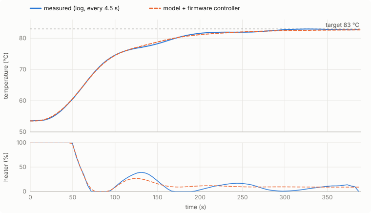
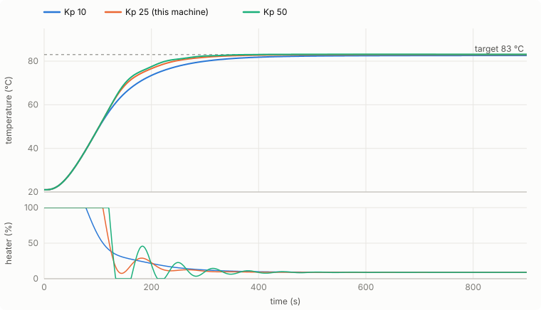
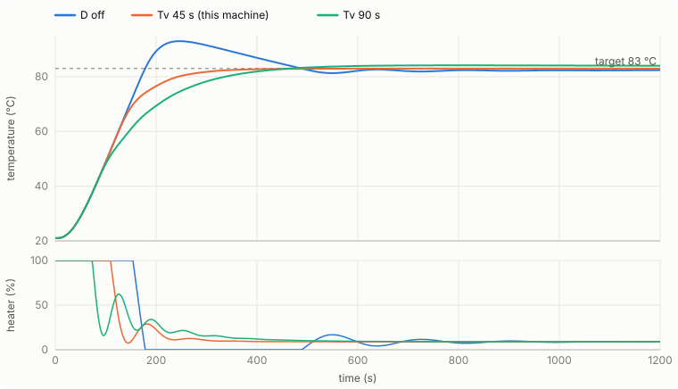
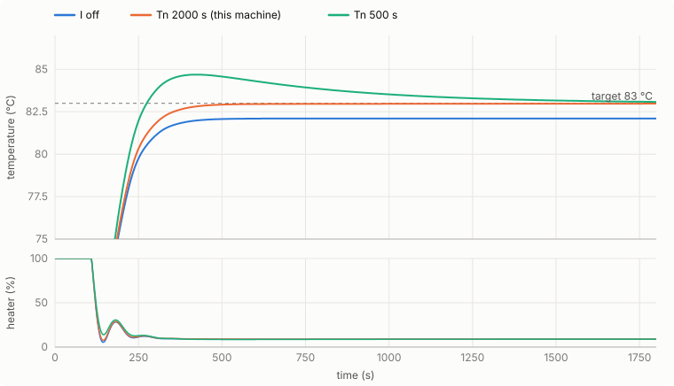
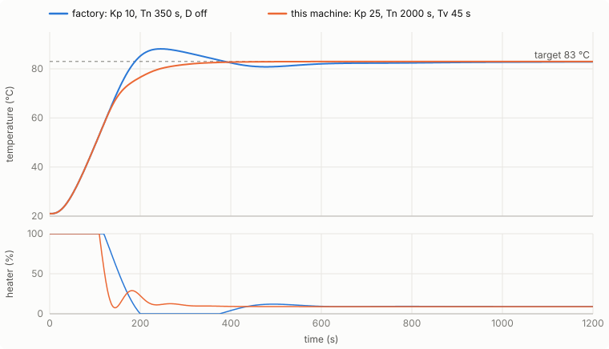
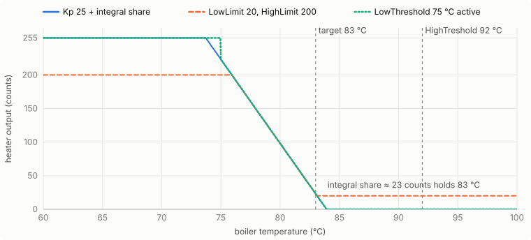
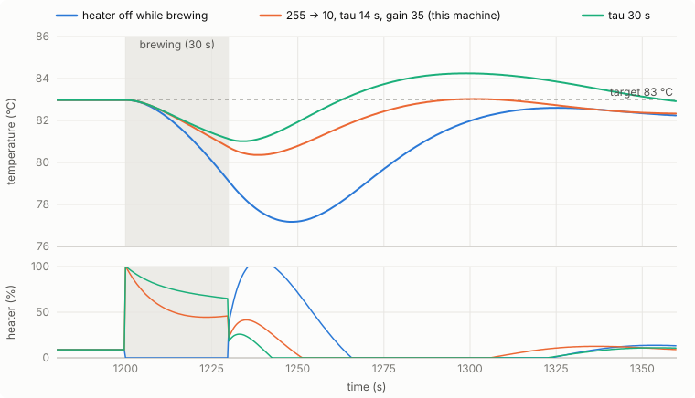
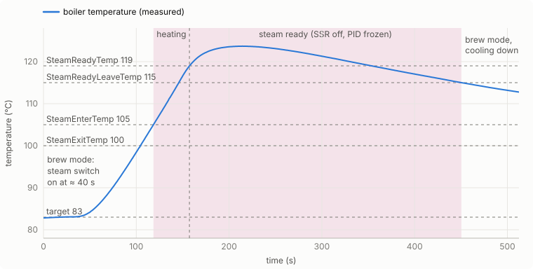
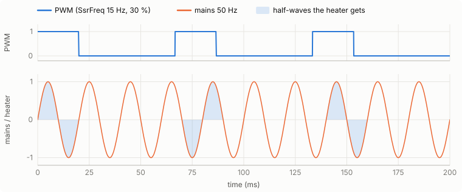
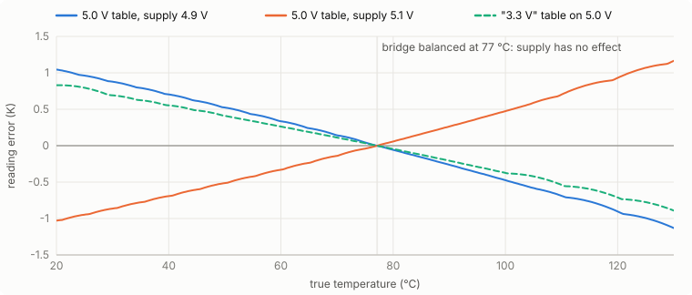

# Calibration

What every setting of the controller does, and how changing it affects the boiler. The settings are on the
**Settings** page (keys as in `params.json`); the Pt1000 conversion is a build option (Kconfig).

Overview of the features: [FEATURES.md](FEATURES.md).

## How the charts were made

The steam chart and the "measured" curves are recordings of this machine. All other charts are
simulations: the firmware's own `PidController`, `BrewFeedForward` and settings mapping, compiled for the
PC, control a model of the boiler. The model has three heat stores (heating element → boiler with water →
Pt1000 on the boiler wall) and losses to the room. Its parameters were fitted to a recorded heat-up of this
machine and to the cooling of the stock machine
([test/host/data](../test/host/data/rancilio_silvia_stock_measurement.csv)). Replaying the recorded heat-up
with the same settings, the model stays within 0.6 K of the measurement (0.26 K RMS):

So treat the charts as a good picture of the trends, not as exact numbers for every machine. The model
needs 9 % heater output to hold 83 °C; the recording shows 7–8 %.

**Units.** The heater output is in *counts*, the SSR duty: 0 = off, 255 ≈ 100 % (8 bit). The web UI shows
it in % of `HighLimitManipulation`. Temperatures in °C, temperature differences in K.

## Settings at a glance

| Section | Key | Factory default | This machine | Meaning |
|---|---|---|---|---|
| PID | `CtrlTarget` | 85 | 83 | brew temperature (°C) |
| PID | `CtrlTimeFactor` | on | on | I and D factors are times (Tn, Tv in s) instead of gains |
| PID | `CtrlPropActivate`, `CtrlPropFactor` | on, 10 | on, 25 | P part: counts per K below the target |
| PID | `CtrlIntActivate`, `CtrlIntFactor` | on, 350 | on, 2000 | I part: reset time Tn (s) |
| PID | `CtrlDifActivate`, `CtrlDifFactor` | off, 0 | on, 45 | D part: lead time Tv (s) |
| PID | `CtrlDifFilterTime` | 5 | 5 | low pass on the D part (s) |
| PID | `LowLimitManipulation`, `HighLimitManipulation` | 0, 255 | 0, 255 | output range (counts) |
| PID | `LowThresholdActivate`, `LowThresholdValue` | off, 0 | off, 0 | below it: full power (°C) |
| PID | `HighThresholdActivate`, `HighTresholdValue` | off, 0 | on, 92 | above it: heater off (°C) |
| PID | `ReadyBand` | 1 | 1 | ± K around the target that count as "ready" |
| PID | `BrewFfStart`, `BrewFfEnd`, `BrewFfTau`, `BrewFfGain` | 255, 10, 14, 35 | same | heater output while brewing |
| Steam | `SteamDetectionActivate` | on | on | steam mode detection |
| Steam | `SteamEnterTemp`, `SteamReadyTemp`, `SteamReadyLeaveTemp`, `SteamExitTemp` | 105, 119, 115, 100 | same | steam thresholds (°C) |
| SSR | `SsrFreq`, `PwmSsrResolution` | 15, 8 | same | PWM of the solid-state relay (Hz, bits) |
| LED | `RwmRgbFreq`, `RwmRgbResolution` | 500, 8 | same | PWM of the status LED (Hz, bits) |
| LED | `GainFactorRed`, `…Green`, `…Blue` | 1 | 1 | brightness per LED channel |
| LED | `GainFactorColorRed`, `…Green`, `…Blue`, `…Orange`, `…Purple`, `…White` | 1 | 0.075–0.5 | brightness per status colour |
| Signal | `SigFilterActive` | on | on | moving average over the last 12 ADC readings |
| System | `TimeToStandby` | 3600 | 7200 | seconds after power-on until standby |

Some key names carry spelling mistakes from the original Arduino firmware (`HighTresholdValue`, `Rwm…`);
they are kept so that old configuration files still load.

## PID controller

Every 375 ms (every third reading of the ADC) the controller computes the heater output from the
deviation *e = target − temperature*:

*output = Kp · ( e + 1/Tn · ∫e dt + Tv · de/dt )*, limited to `LowLimitManipulation` … `HighLimitManipulation`

With `CtrlTimeFactor` off, the factors are plain gains instead: *output = Kp·e + Ki·∫e dt + Kd·de/dt*.
I and D only work while P is active.

The Silvia's boiler reacts slowly: after the heater switches off, the temperature at the sensor keeps
rising for about half a minute. That shapes the whole tuning: the controller has to stop heating long before
the target is reached.

### Proportional part: `CtrlPropFactor` (Kp)

Counts of heater output per kelvin below the target. With Kp 25 the heater runs at full power up to about
10 K below the target (255 / 25) and backs off linearly from there.

- **Higher Kp** reaches the target sooner (50: in 5 min from a cold start) but reacts harder to every
  disturbance, which with a noisy sensor means a nervous heater.
- **Lower Kp** approaches slowly (10: about 10 min).
- With this boiler the D part does most of the braking, so Kp mainly sets how firmly the target is held.

### Derivative part: `CtrlDifFactor` (Tv) and `CtrlDifFilterTime`

The D part reacts to how fast the temperature changes. Tv 45 s with Kp 25 means 1125 counts per K/s: at
0.5 K/s while heating up it subtracts about 560 counts, so the heater goes off well before the target, and
the heat still stored in the element carries the boiler the rest of the way.

- **Without D**, the heater stays on too long: the model overshoots to 93 °C. `HighTresholdValue` 92 °C
  cannot prevent that; it switches off, but the heat is already in the element.
- **Tv 45 s** comes in without overshoot.
- **Tv 90 s** brakes too early and creeps towards the target.

`CtrlDifFilterTime` (5 s) smooths the D part. The temperature changes in tiny steps, and each step would
otherwise make the D part jump. Larger values smooth more but delay the braking; 0 switches the filter off.

### Integral part: `CtrlIntFactor` (Tn)

The I part removes the remaining deviation. Holding 83 °C needs about 9 % output (23 counts) against the
heat losses. P alone would only deliver that with the boiler about 1 K below the target. The integral
builds up these 23 counts so that the boiler sits exactly on the target. Tn is the time the integral needs
to add as much as P does for the same deviation: the smaller Tn, the faster (and more aggressive) it acts.

- **I off**: the boiler stays about 1 K below the target.
- **Tn 2000 s**: reaches the target without overshoot. The integral fills up during the heat-up already.
- **Tn 500 s**: overshoots by almost 2 K and is within 0.5 K of the target only after about 17 minutes.

The integral only grows while the output is below the upper limit, and never goes negative (anti-windup).
It is cleared when gains, active terms or limits change, and after brewing or steam mode (see below).
Changing only the target keeps it.

### Factory defaults vs. this machine

The factory defaults come from the Arduino firmware. On this boiler they overshoot by 5 K and settle only
after about 14 minutes. The values of this machine (Kp 25, Tn 2000 s, Tv 45 s) reach the target in about
6 minutes without overshoot:

### Limits and thresholds

- `LowLimitManipulation` / `HighLimitManipulation`: the output range in counts. A low limit above 0 keeps
  the heater always on a little (orange: 20 counts even above the target); a high limit below 255 caps the
  power. Changing them clears the integral.
- `LowThresholdValue` (if active): below this temperature, full power regardless of the PID. Can speed up a
  cold start, but with this boiler the PID is at full power down there anyway.
- `HighTresholdValue` (if active): above this temperature, the heater is off regardless of the PID. A
  safety net against a runaway; it does not prevent overshoot from the stored heat (see the D part).
- `ReadyBand` (1 K): within target ± ReadyBand the machine counts as ready (LED green, Home Assistant
  `ready`). Below it shows "heating up" (orange), above "cooling down" (blue). It does not change the
  control.

### Tuning tips

1. Start from the values of this machine. Change one factor at a time and watch a cold start on the Graphs
   page (download `data.csv` to compare runs).
2. Overshoot after the heat-up → more Tv (or less Kp). Slow creep towards the target → less Tv.
3. Stays below the target for a long time → shorter Tn, but watch for overshoot (Tn 500 s: +2 K).
4. Oscillation around the target → less Kp or a longer `CtrlDifFilterTime`.

## Brewing: feed-forward

When the pump runs (the pump relay is wired to the ESP32 and debounced for 200 ms), the PID pauses. Cold
water flows into the boiler and the heater lags by about a minute, so the PID would only react once the
shot is over. Instead the heater output follows a fixed curve:

*output = level + `BrewFfGain` · (target − temperature)*, where *level* starts at `BrewFfStart` and decays
exponentially towards `BrewFfEnd` with the time constant `BrewFfTau`.

| Key | Default | Effect |
|---|---|---|
| `BrewFfStart` | 255 | output at the start of the shot (counts): front-loads heat |
| `BrewFfEnd` | 10 | level that the decay approaches |
| `BrewFfTau` | 14 s | how fast the level decays from start to end; 0 = jump to end immediately |
| `BrewFfGain` | 35 | extra counts per K below the target, corrects the curve while brewing |

This chart is a simulation of a 30 s shot. The amount of cold water is an assumption (2 ml/s at 21 °C,
1000 W heater), so the depth of the dip is only indicative. The comparison holds:

- **Heater off while brewing** (all four values 0): the boiler drops 6 K.
- **Default curve**: drops less than 3 K and comes back to the target without overshoot.
- **Tau 30 s**: drops slightly less, but too much heat goes in and the boiler overshoots by more than 1 K
  after the shot.

Tune it with real shots: if the temperature overshoots after the shot, reduce `BrewFfTau` or `BrewFfStart`;
if it dips deep and recovers slowly, increase them.

**After the shot** the PID starts clean, with an empty integral. In the simulation the boiler then sits
about 0.8 K below the target for more than 10 minutes, and with Tn 2000 s it takes about 50 minutes until
the integral has rebuilt the missing 23 counts. A shorter Tn shortens this (Tn 500 s: about 13 minutes), at the price of overshoot after a cold start.

## Steam mode

The steam switch of the Silvia bypasses the SSR and heats the boiler up to the bimetal switch (about
120 °C). The firmware has no input for the switch, so it detects steam mode from the temperature:

| Key | Default | Meaning |
|---|---|---|
| `SteamDetectionActivate` | on | steam detection on/off |
| `SteamEnterTemp` | 105 °C | rising above it: steam mode, heating up (LED magenta, blinking); SSR off, PID frozen |
| `SteamReadyTemp` | 119 °C | steam ready (LED magenta) |
| `SteamReadyLeaveTemp` | 115 °C | falling below it after ready: steam mode over, back to brew mode (LED blue, cooling down) |
| `SteamExitTemp` | 100 °C | falling below it: detection armed again |

Between `SteamReadyLeaveTemp` and `SteamExitTemp` the state machine remembers that steam mode was on:
reaching `SteamReadyTemp` again (steam switch on again) returns straight to "steam ready".

Rules, checked when saving:
`SteamExitTemp < SteamEnterTemp < SteamReadyTemp` and `SteamExitTemp < SteamReadyLeaveTemp < SteamReadyTemp`.
The detection is off while the target is not below `SteamExitTemp`, because the PID's overshoot could then
trigger it.

How to set them: watch a steam session on the Graphs page. `SteamReadyTemp` should be just below the
temperature at which your bimetal switch opens (here the boiler peaked at 123.6 °C, read by the sensor on
the wall). `SteamEnterTemp` must lie above anything the PID reaches in brew mode, including overshoot.

## SSR: `SsrFreq` and `PwmSsrResolution`

The ESP32 drives the solid-state relay with PWM, 15 Hz and 8 bit by default. A zero-crossing SSR only
switches when the mains voltage crosses zero, so the heater always gets whole half-waves (100 per second at
50 Hz):

At 15 Hz one PWM period spans 6.7 half-waves. Because the periods do not line up with the mains, the number
of half-waves per period varies, and on average the duty is right. The boiler is far too slow to notice.

- Leave **15 Hz** unless you have a reason: much higher frequencies leave fewer half-waves per period, so
  the duty becomes coarse; lower frequencies switch the heater in longer on/off blocks.
- **Resolution**: the output counts are written to the PWM unchanged. With 10 bit, 255 counts would be only
  25 % power: change `HighLimitManipulation`, `LowLimitManipulation`, `CtrlPropFactor` and the brew values
  together (×4 for 10 bit). Keep 8 bit.

## Temperature measurement

### `SigFilterActive`

A moving average over the last 12 readings of the ADS1115 (8 per second, so 1.5 s). It removes noise from
the reading and from the D part. The delay (about 0.75 s) is small against the boiler's lag. Leave it on.

### Pt1000 conversion (build option)

The Pt1000 sits in a Wheatstone bridge with three 1298 Ω resistors, supplied with 5 V; the ADS1115 measures
the bridge voltage. `idf.py menuconfig` → bananactrl → *Pt1000 temperature conversion* selects how this
voltage becomes a temperature:

| Option | Use |
|---|---|
| **Lookup table, 5.0 V** (default) | the hardware in the machine; exact at the table points |
| Lookup table, "3.3 V" | the Arduino table; actually computed for a 5.08 V supply |
| Linear / quadratic regression | fits for a 3.3 V supply; about 50 K off on the 5 V hardware |

The bridge is balanced at 77 °C (the Pt1000 has 1298 Ω there), where the supply voltage has no influence on
the reading. The further away from 77 °C, the more a deviation of the 5 V supply matters:

| Temperature | supply 4.9 V | supply 5.1 V | "3.3 V" table |
|---|---|---|---|
| 83 °C | −0.12 K | +0.12 K | −0.09 K |
| 93 °C | −0.33 K | +0.33 K | −0.26 K |
| 120 °C | −0.90 K | +0.93 K | −0.71 K |

At brew temperatures a few percent of supply deviation cost a few tenths of a kelvin. There is no offset
setting: if a reference thermometer disagrees, set `CtrlTarget` to the value that gives the temperature you
want.

## Status LED

The LED colours are mixed from three PWM channels (`RwmRgbFreq` 500 Hz, `RwmRgbResolution` 8 bit; there is
no reason to change them). Two kinds of brightness factors:

- `GainFactorColorRed`, `…Green`, `…Blue`, `…Orange`, `…Purple`, `…White`: brightness of one status colour
  (0…1). On this machine 0.075–0.5, so the LED does not glare. Magenta (steam) has no factor of its own.
- `GainFactorRed`, `…Green`, `…Blue`: brightness of one LED channel for all colours, to balance an LED
  whose channels differ in brightness. Not applied to purple (fault), which is always clearly visible.

## Standby: `TimeToStandby`

Seconds after power-on until the heater switches off for good (until restart or power cycle). Counted from
power-on, not from the last shot. In Home Assistant the same value is "Standby after" in minutes; a value
below the current uptime means standby now.
