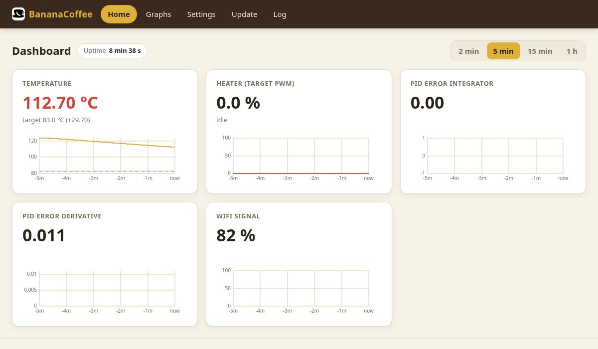
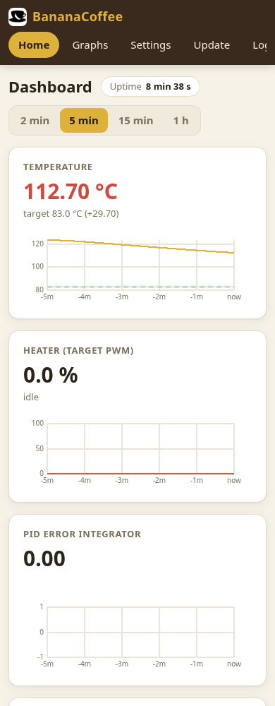
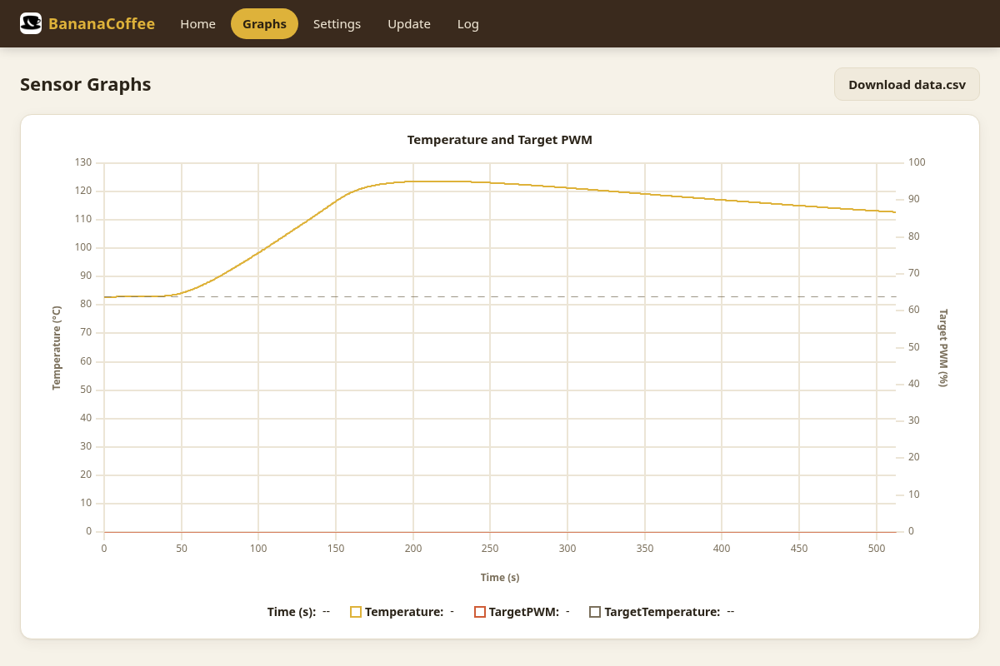
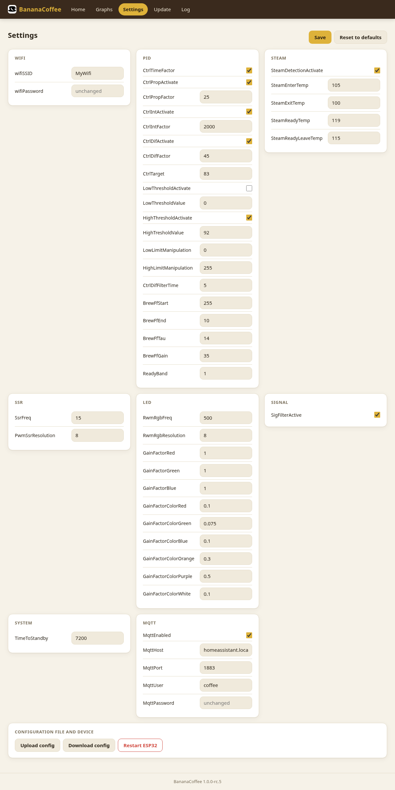
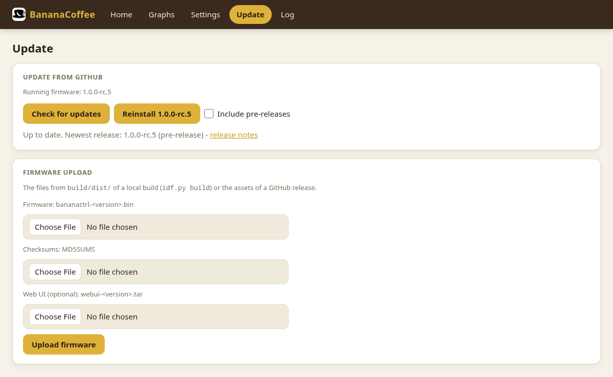
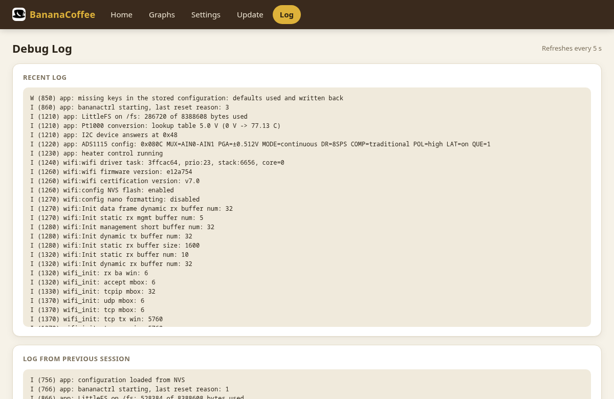

# Features

bananactrl replaces the bimetal brew thermostat of a Rancilio Silvia with a PID controller on an ESP32. It
measures the boiler with a Pt1000, drives the heater through a solid-state relay and shows everything in a
web UI. You open it in the browser at http://coffee.local/, and it also works without internet.

For building and flashing see the [README](../README.md); for what every setting does see
[CALIBRATION.md](CALIBRATION.md); for the internals see [ARCHITECTURE.md](ARCHITECTURE.md).

## At a glance

- **Stable brew temperature:** a PID controller holds the boiler at the target (default 83 °C), with a
  configurable band of ±1 K that counts as "ready".
- **Brew compensation:** the controller notices when the pump runs and front-loads the heater, so the
  temperature drops less during a shot.
- **Steam mode:** detected from the temperature alone; while you steam, the controller stays out of the way.
- **Status LED:** shows the machine state at a glance: heating up, ready, brewing, steam, fault.
- **Web UI:** live dashboard, recorded graphs, settings, firmware update, log. Works on the phone and
  offline (no CDN; in SoftAP mode too).
- **Home Assistant:** optional MQTT with auto-discovery: temperature, state, target temperature, standby.
- **Updates over the air:** from GitHub releases with one click, or by uploading a local build.
- **Safety:** the heater switches off at once on a sensor or ADC fault, above a temperature limit and in
  standby.

## Web UI

### Dashboard

Live values, pushed once per second: boiler temperature (blue below the target, green within the ready
band, red above), heater output, the PID terms and the Wi-Fi signal. Each widget has a trend for the last
2 min to 1 h; hover over a trend to read older values. The screenshot shows the boiler cooling down after
steaming: the heater stays off until the temperature is back near the target.

### Graphs

The whole session since power-on: temperature, heater output and target. New rows arrive live. The
screenshot shows a steam session: ready at 83 °C, steam switch on (the boiler heats up to about 124 °C on
its own, the controller keeps the heater off), steam switch off and cooling down.
**Download data.csv** saves the recording, for example to compare shots or tune the PID.

### Settings

All parameters, grouped into cards: Wi-Fi, PID (target temperature, gains, limits, brew feed-forward,
ready band), steam thresholds, SSR, LED brightness, standby time and MQTT. **Save** applies them at once
(Wi-Fi and MQTT after a restart). The settings survive firmware updates. Stored passwords are never shown;
an empty field keeps them. At the bottom: **Download config** / **Upload config** (backup as JSON) and
**Restart ESP32**.

The settings most people touch:

| Setting | Section | Meaning |
|---|---|---|
| `CtrlTarget` | PID | brew temperature in °C |
| `TimeToStandby` | System | seconds after power-on until the heater goes into standby |
| `SteamDetectionActivate` | Steam | steam mode on/off |
| `MqttEnabled`, `MqttHost`, ... | MQTT | Home Assistant connection |

All other settings, with charts of their effect: [CALIBRATION.md](CALIBRATION.md).

### Update

**Check for updates** asks GitHub for the newest release (optionally pre-releases). **Install** downloads
the firmware and the web pages, checks them against the release's `MD5SUMS` and restarts. Without
internet, upload the files of a release or a local build instead. If a new firmware does not start
properly, the controller rolls back to the previous one.

### Log

The log of the current and the previous session (boot, Wi-Fi, faults, brewing, steam), useful after
something went wrong.

## Status LED

| Colour | Meaning |
|---|---|
| white | booting |
| orange, pulsing | heating up |
| green | ready |
| blue, pulsing | cooling down to the target |
| red | brewing |
| magenta, blinking | steam mode, heating up |
| magenta | steam ready |
| purple | fault (heater off, except for a Wi-Fi fault) |

## Steam mode

The steam switch of the Silvia bypasses the controller and heats the boiler up to the bimetal switch
(about 120 °C), so the controller recognises steam mode from the temperature: above 105 °C it switches the
heater off and freezes the PID, at 119 °C the LED says "steam ready". When the temperature falls below
115 °C (steam switch off), it controls back down to the brew temperature. The thresholds are in the
**Steam** settings; details in the [README](../README.md#steam-mode).

## Home Assistant

With MQTT enabled, the controller appears in Home Assistant as **BananaCoffee** without any YAML:

- sensors for temperature, heater power, machine state, time to standby, Wi-Fi signal and faults
- the target temperature and the standby time as numbers you can change from Home Assistant
- a restart button (also wakes it from standby)

So you can, for example, show the temperature on a dashboard, get a notification when the machine is
ready, or put it into standby from an automation. Setup: [README](../README.md#home-assistant-mqtt-optional).

## First start

1. Flash the firmware (see the [README](../README.md#flash)).
2. Without known Wi-Fi the controller opens the open access point **SilviaCoffeeCtrl**; connect and open
   http://192.168.4.1/.
3. Enter your Wi-Fi under **Settings → Wifi**, save and restart. From then on it is at
   http://coffee.local/.
